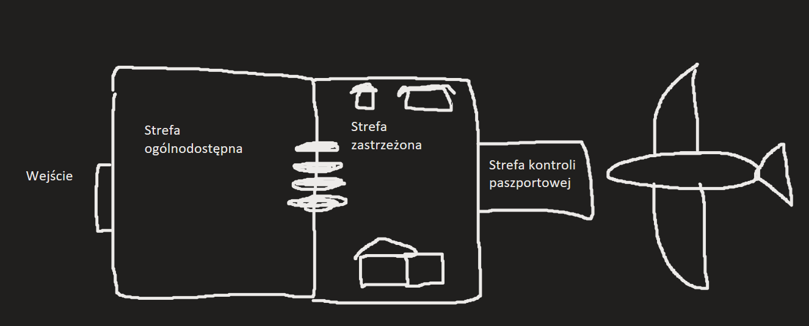
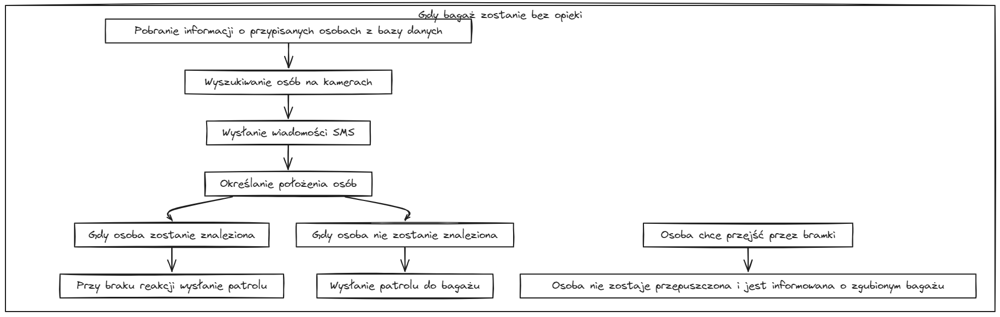

# Strefy

# punkt widzenia pasażera

## początkowo pasażer:

- wchodzi na strefe zastrzeżoną
- kamery na lotnisku robią mu zdjęcia 
- do zdjęć dołączane są informacje z zeskanowanego wcześniej biletu
- kamery przypisują osobom bagaże (jeden do wielu, wiele do wielu)
- te informacje są zapisywane w bazie danych

## Gdy bagaż zostanie bez opieki

- z bazy pobiera sie informacje o przypisanych osobach do zagubionego bagażu
- na wszystkich kamerach szuka się przypisanych osób
- zostaje wysłana wiadomość sms z odpowiednim komunikatem o zagubionym bagażu: *na podstawie przypisanych danych z biletu* **(treść nie może dać im świadomości że są śledzeni, ale na przykład powiadomić o zbliżającym się odlocie, by pasażer się przygotował, i przypomniał o bagażu)**
- określane jest położenie tych osób
  - gdy osoba będzie znaleziona
    - *przy braku reakcji zostanie do niego wysłany patrol*
  - gdy osoba nie będzie znaleziona
    - *wysyłany jest na miejsce z bagażem patrol do znalezienia osoby*
- gdy osoba z zagubionym bagażem chce przejść przez bramki (nie będąc świadomym o zagubieniu bagażu) 
  - *nie zostanie przepuszczona. Osoba wtedy zostanie poinformowania o zgubionym bagażu*

# co jeśli jury spyta sie do danych o biletach

## jeśli klientem jest lotnisko

- dane przechowuje: **dział IT**, **dział obsługi bagażowej**
  *! Przedyskutować to z mentorami*

